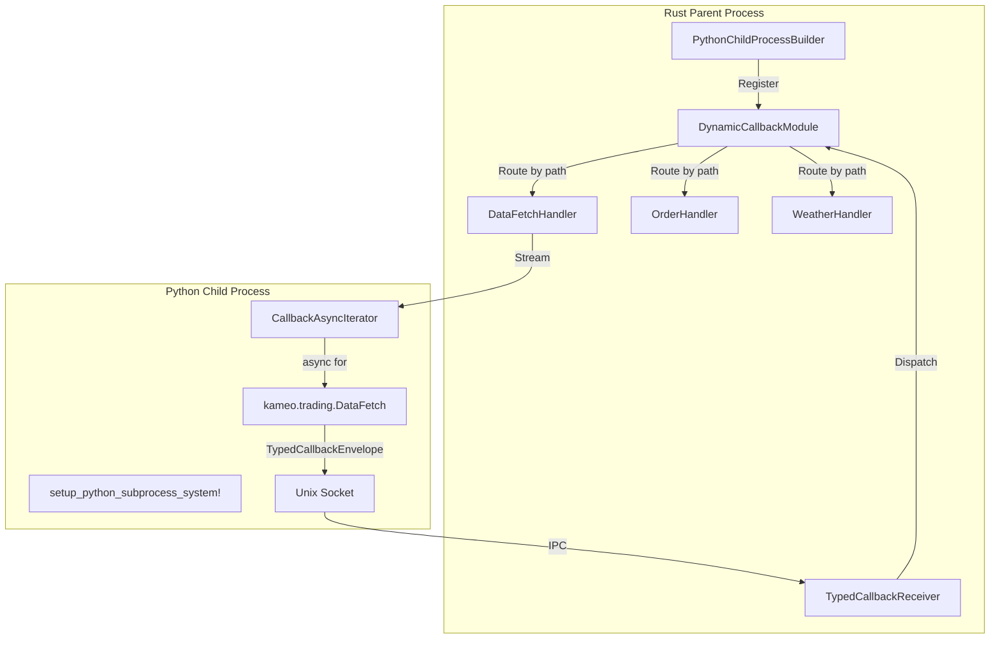

# Kameo Snake Handler System

A type-safe system for orchestrating Python subprocesses from Rust with dynamic callback routing, streaming responses, and Python module generation. Provides async Rust/Python interop with OpenTelemetry tracing and structured error handling.

---

## Quickstart (macOS & Linux)

The included `Makefile` automates all setup and test flows, and works out of the box on both macOS and Linux. It hopefully auto-detects your Python and library paths

**To set up and run all integration tests:**

```sh
make pyenv      # Create a Python venv using python3 from your PATH
make install    # Install Python requirements into the venv
make run        # Run the full Rust+Python integration test suite
```

- On macOS, the Makefile will automatically find and set the correct DYLD_LIBRARY_PATH for your Python install.
- On Linux, it uses LD_LIBRARY_PATH as needed.

---

- **kameo-child-process**: Core IPC engine with dynamic callback routing, streaming protocols, and strongly-typed handlers. Generic foundation for any subprocess orchestration. [Read the detailed README](./crates/kameo-child-process/README.md)
- **kameo-snake-handler**: Python integration layer with runtime module generation, callback APIs, and async interop. Maps Rust callback handlers to Python module functions. [Read the detailed README](./crates/kameo-snake-handler/README.md)
- **kameo-snake-testing**: Comprehensive integration tests demonstrating high-volume callbacks, multiple handler types, and real-world usage patterns including trading systems and streaming data.

---

## Key Features

### 🚀 **Dynamic Callback System**

- **Runtime Registration**: Callback handlers registered by module/type at runtime
- **Python Module Generation**: Rust handlers mapped to `kameo.module.HandlerType()` functions
- **Type-Safe Routing**: Type-safe routing from Python requests to Rust handlers
- **Streaming Responses**: All callbacks return async iterators for uniform interface

### ⚡ **High Performance**

- **Connection Sharing**: Single Unix socket handles multiple concurrent callbacks
- **Binary Serialization**: serde-brief (serde) encoding with length prefixing for wire protocol
- **Async Support**: async/await support in both Rust and Python
- **Correlation IDs**: Request/response matching for multiplexed streams

### 🐍 **Elegant Python Integration**

- **Two API Styles**: Module-based `kameo.trading.DataFetch(data)` and string-based `kameo.callback_handle()`
- **Runtime Module Creation**: Python modules created at runtime from Rust handler registration
- **Async Iterators**: Python async iterators for streaming Rust responses
- **Error Propagation**: Error types converted across the language boundary

### 📊 **Production Ready**

- **OpenTelemetry Integration**: Tracing spans across process boundaries
- **Error Handling**: Strongly-typed errors with context information
- **Process Lifecycle**: Startup, shutdown, and connection management
- **Testing**: Property-based tests and integration tests

---

## Quick Example

Example of the Python API with dynamic callback registration:

### Rust Handler Registration

```rust
// Register handlers with the builder
let pool = PythonChildProcessBuilder::<TradeMessage>::new(config)
    .with_callback_handler("market", DataFetchHandler)
    .with_callback_handler("market", OrderBookHandler)  
    .with_callback_handler("risk", PositionCheckHandler)
    .spawn_pool(4, None).await?;
```

### Generated Python API

```python
import kameo

async def trading_strategy(message):
    # Module-based API created at runtime
    async for price in kameo.market.DataFetch({'symbol': 'AAPL'}):
        print(f"Price: ${price['value']}")
        
    async for order in kameo.market.OrderBook({'symbol': 'AAPL', 'depth': 10}):
        print(f"Order: {order}")
        
    # Risk check using different module
    risk_result = kameo.risk.PositionCheck({'portfolio': portfolio_data})
    async for risk_metric in risk_result:
        if risk_metric['risk_level'] > 0.8:
            break  # Stop trading
    
    return {"status": "completed"}
```

## Getting Started

- For generic process orchestration, start with [`kameo-child-process`](./crates/kameo-child-process/README.md).
- For Python subprocess orchestration, see [`kameo-snake-handler`](./crates/kameo-snake-handler/README.md).
- To see real-world usage and integration tests, check [`kameo-snake-testing`](./crates/kameo-snake-testing/).

---

## Architecture Overview



### **Key Components:**

- **🏗️ Parent Process (Rust)**: Manages subprocess pool, routes callbacks by path, executes typed handlers
- **🐍 Child Process (Python)**: Runtime-created module APIs, async iterators, connection sharing  
- **🔄 Dynamic Routing**: `kameo.trading.DataFetch()` → `DynamicCallbackModule` → `DataFetchHandler`
- **📡 Streaming Protocol**: All responses are streams with correlation IDs and termination signals
- **🔍 Observability**: OpenTelemetry spans across process and callback boundaries

---

## Documentation

### 📚 **Comprehensive Guides**

- [**kameo-child-process README**](./crates/kameo-child-process/README.md): Dynamic callback system, streaming protocols, typed handlers, and IPC architecture
- [**kameo-snake-handler README**](./crates/kameo-snake-handler/README.md): Python integration, runtime module generation, callback APIs, and complete examples

### 🧪 **Examples & Testing**

- [**kameo-snake-testing**](./crates/kameo-snake-testing/): High-volume callback tests, multiple handler types, and real-world usage patterns
- **Integration Tests**: Run `make run ARGS="streaming-callbacks"` to test the system

### 🏗️ **Key Design Patterns**

- **Dynamic Registration**: Handlers registered at runtime, routed by path
- **Streaming Interface**: Async iterator interface for all responses  
- **Type Safety**: Type-safe routing from Python requests to Rust handlers
- **Module Organization**: Logical grouping of related callback handlers
- **Connection Sharing**: Single socket for multiple callback types