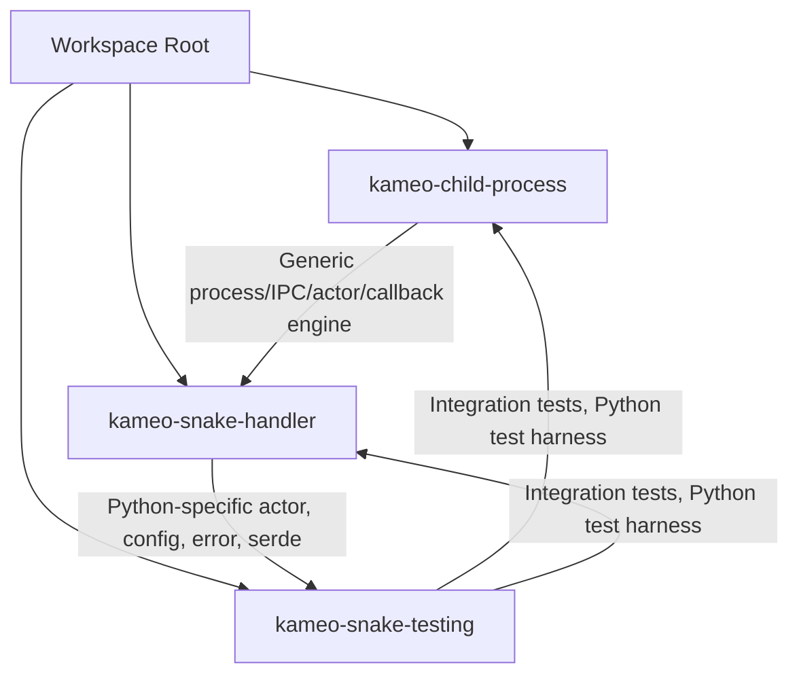

# Kameo Snake Handler System

A modular, async, protocol-correct system for orchestrating Python subprocesses from Rust, with deep tracing, strict error handling, and robust IPC. This workspace is designed for building, testing, and extending actor-based process orchestration with seamless Rust/Python interop.

---

## Project Structure

- **kameo-child-process**: The generic, protocol-correct process/IPC/actor/callback engine. Use this for any kind of child process management, not just Python. [Read the detailed README](./crates/kameo-child-process/README.md)
- **kameo-snake-handler**: Python-specific process actor, configuration, error handling, and (de)serialization. Builds on the process crate to provide seamless async Rust/Python orchestration. [Read the detailed README](./crates/kameo-snake-handler/README.md)
- **kameo-snake-testing**: Integration test harness, including real Python scripts and async test flows. Demonstrates and validates the full protocol, error handling, and callback flows.

---

## Key Features

- **Async, actor-based process orchestration**
- **Strict protocol and handshake flows**
- **Typed, async callback IPC**
- **Deep tracing and OpenTelemetry integration**
- **Property-based and integration testing**
- **Separation of generic process logic and Python-specific logic**

---

## Getting Started

- For generic process orchestration, start with [`kameo-child-process`](./crates/kameo-child-process/README.md).
- For Python subprocess orchestration, see [`kameo-snake-handler`](./crates/kameo-snake-handler/README.md).
- To see real-world usage and integration tests, check [`kameo-snake-testing`](./crates/kameo-snake-testing/).

---

## Architecture Overview

- **Parent process** (Rust): Spawns and manages child processes, sends/receives messages, handles callbacks.
- **Child process** (Rust+Python): Loads Python modules/functions, executes async/sync logic, communicates via strict IPC protocol.
- **Callback system**: Allows Python code to request information or actions from the Rust parent asynchronously.
- **Tracing**: All flows are instrumented for distributed tracing and debugging.

---

## Documentation

- [kameo-child-process README](./crates/kameo-child-process/README.md): Protocol, builder, actor, callback, and error details.
- [kameo-snake-handler README](./crates/kameo-snake-handler/README.md): Python-specific flows, runtime/interop, macro usage, and callback injection.

---