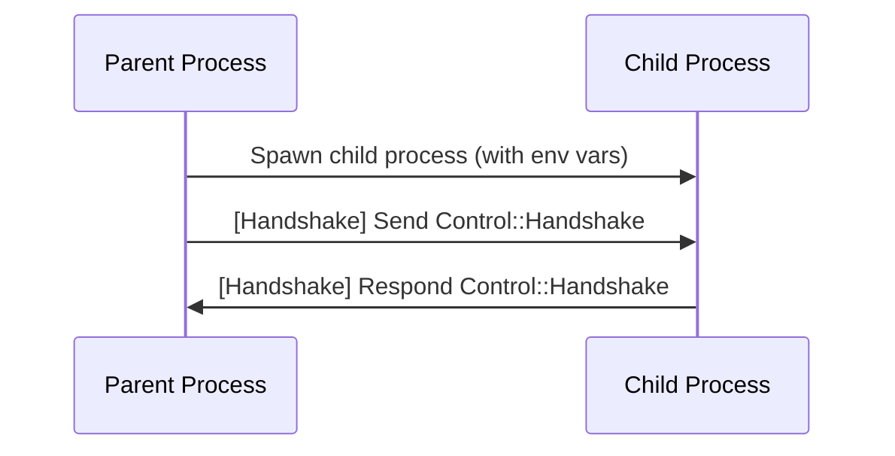
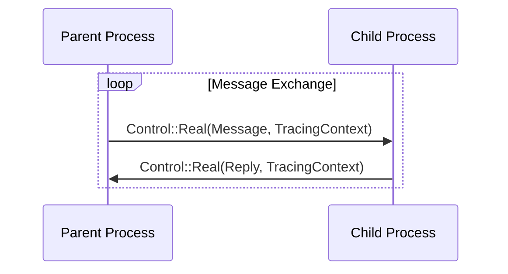
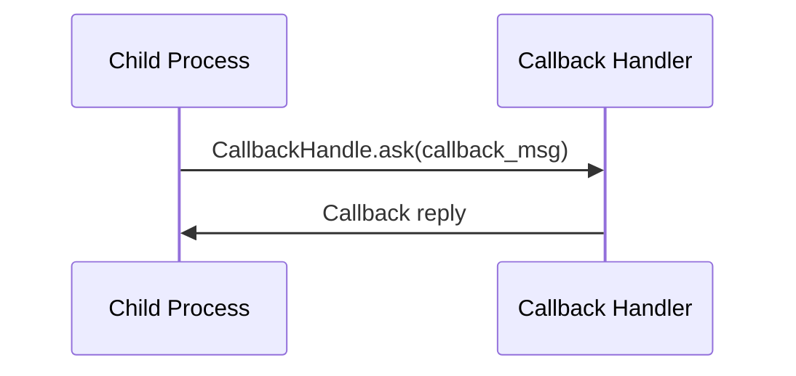

# kameo-child-process

A Rust crate for robust, async, protocol-correct child process management and IPC.

This crate provides the generic process/IPC/actor/callback engine for the Kameo system.
---

## Features

- **SubprocessActor**: Actor for managing a child process and async IPC.
- **ChildProcessBuilder**: Builder for configuring and spawning child process actors.
- **Callback system**: Typed, async callback IPC between parent and child.
- **Handshake protocol**: Strict, traceable handshake for process startup.
- **Error types**: Rich, typed error handling for all protocol and IPC failures.
- **Tracing**: Deep, async-aware tracing for all message flows and errors.

---

## Protocol & Message Flow

### 1. Process Startup & Handshake



- Parent spawns the child process, setting up two Unix sockets (request & callback) and passing their paths via environment variables.
- Child connects to the request socket.
- Parent sends a handshake message (`Control::Handshake`).
- Child responds with a handshake ack (`Control::Handshake`).

---

### 2. Message Exchange



- All messages are wrapped in a `Control::Real` variant, carrying both the message and a tracing context for distributed tracing.
- Replies are sent back the same way.

---

### 3. Callback Flow (if used)



- The child can send callback requests to the parent (or a callback handler) using the callback socket.
- The callback handler processes the request and replies.

---

### 4. Shutdown

- On shutdown, both parent and child clean up their sockets and terminate the process cleanly.

---

## Key Types & Traits

- **SubprocessActor**: The main actor for a child process.
- **ChildProcessBuilder**: Fluent builder for configuring and spawning actors.
- **CallbackHandler / NoopCallbackHandler**: Trait and default impl for handling callback messages.
- **ChildCallbackMessage**: Trait for callback message types.
- **ProtocolError, SubprocessActorError**: Rich error types for all protocol and IPC failures.

---

## Example: Spawning a Child Process

```rust
use kameo_child_process::{ChildProcessBuilder, NoopCallbackHandler, SubprocessActor, KameoChildProcessMessage};

let builder = ChildProcessBuilder::<SubprocessActor<MyMsg, MyCallback, MyError>, MyMsg, MyCallback, MyError>::new()
    .with_actor_name("my_actor")
    .log_level(tracing::Level::INFO);

let (actor_ref, callback_receiver) = builder.spawn(NoopCallbackHandler).await?;
tokio::spawn(callback_receiver.run());
```

---

## Error Handling

- All errors are strongly typed and instrumented with tracing.
- Protocol errors, handshake failures, and connection issues are all surfaced as distinct error types.

---

## Tracing & Telemetry

- All message flows, handshakes, and errors are traced with `tracing` and OpenTelemetry.
- Spans are propagated across process boundaries for full distributed traceability.

---
