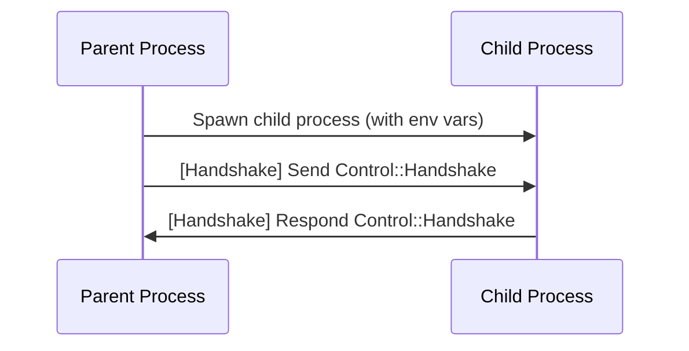
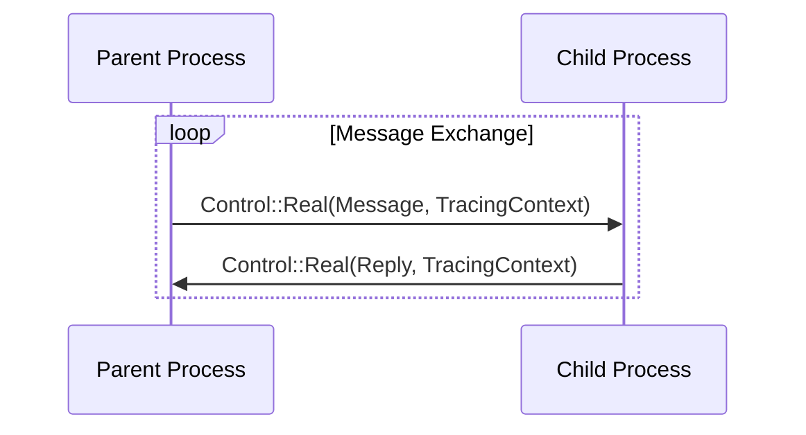
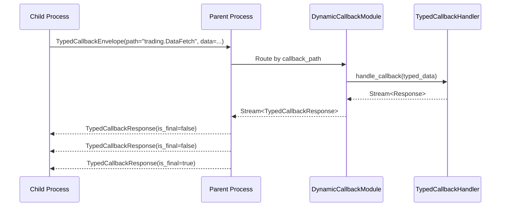

# kameo-child-process

A Rust crate for robust, async, protocol-correct child process management and IPC with dynamic callback routing.

This crate provides the generic process/IPC/actor/callback engine for the Kameo system, supporting both synchronous and streaming communication patterns.

---

## Features

- **SubprocessIpcBackend**: Core IPC backend for parent-child communication over Unix sockets
- **SubprocessIpcActor**: Kameo actor wrapper providing async message handling
- **DynamicCallbackModule**: Runtime callback registration with automatic routing and type safety
- **TypedCallbackHandler**: Strongly-typed, streaming callback handlers
- **Unified Streaming Protocol**: All responses treated as streams for consistency
- **Handshake Protocol**: Strict connection establishment with timeout handling
- **Error Handling**: Rich, typed error propagation across process boundaries
- **Distributed Tracing**: OpenTelemetry integration with span propagation
- **Metrics Collection**: Performance monitoring with correlation ID tracking

---

## Protocol & Message Flow

### 1. Process Startup & Handshake



- Parent spawns the child process, setting up two Unix sockets (request & callback) and passing their paths via environment variables.
- Child connects to the request socket.
- Parent sends a handshake message (`Control::Handshake`).
- Child responds with a handshake ack (`Control::Handshake`).

---

### 2. Message Exchange



- All messages are wrapped in a `Control::Real` variant, carrying both the message and a tracing context for distributed tracing.
- Replies are sent back the same way.

---

### 3. Dynamic Callback System



**Key Features:**

- **Dynamic Routing**: Callbacks routed by path (e.g., "trading.DataFetch") to registered handlers
- **Type Safety**: Each handler strongly typed for request/response types
- **Streaming Responses**: All handlers return async streams, supporting both single and multi-item responses
- **Connection Sharing**: Single Unix socket shared across multiple concurrent callback requests
- **Correlation IDs**: Responses matched to requests via unique correlation identifiers

---

### 4. Shutdown

- On shutdown, both parent and child clean up their sockets and terminate the process cleanly.

---

## Key Types & Traits

### Core IPC Components

- **`SubprocessIpcBackend<M>`**: Core IPC backend managing Unix socket communication and multiplexing
- **`SubprocessIpcActor<M>`**: Kameo actor wrapper providing async message interface
- **`KameoChildProcessMessage`**: Trait for message types with associated response types

### Dynamic Callback System

- **`DynamicCallbackModule`**: Runtime callback registration and routing by module/type path
- **`TypedCallbackHandler<C>`**: Trait for strongly-typed callback handlers with streaming responses
- **`TypedCallbackReceiver`**: Component that receives and dispatches callback requests
- **`TypedCallbackEnvelope`**: Request envelope with callback path, correlation ID, and serialized data
- **`TypedCallbackResponse`**: Response envelope with streaming termination flag (`is_final`)

### Protocol Types

- **`Control<T>`**: Protocol control messages (Handshake, Sync, Stream, StreamEnd)
- **`MultiplexEnvelope<T>`**: Message wrapper with correlation ID and tracing context
- **`ReplySlot<R>`**: Unified slot for both sync and streaming response handling

### Error Types

- **`PythonExecutionError`**: Rich error types for execution, serialization, and IPC failures
- **`SubprocessIpcBackendError`**: Protocol and connection-level error types

---

## Example: Using the Dynamic Callback System

### Rust Parent Process

```rust
use kameo_child_process::callback::{DynamicCallbackModule, TypedCallbackHandler};
use serde::{Serialize, Deserialize};
use bincode::{Encode, Decode};

// Define your callback types
#[derive(Serialize, Deserialize, Encode, Decode, Debug)]
struct DataFetchRequest {
    symbol: String,
    start_date: String,
}

#[derive(Serialize, Deserialize, Encode, Decode, Debug)]
struct DataFetchResponse {
    data: Vec<f64>,
    timestamp: String,
}

// Implement the handler
struct DataFetchHandler;

#[async_trait::async_trait]
impl TypedCallbackHandler<DataFetchRequest> for DataFetchHandler {
    type Response = DataFetchResponse;
    
    async fn handle_callback(
        &self, 
        request: DataFetchRequest
    ) -> Result<Pin<Box<dyn Stream<Item = Result<Self::Response, PythonExecutionError>> + Send>>, PythonExecutionError> {
        // Return streaming responses
        let responses = (0..5).map(|i| {
            Ok(DataFetchResponse {
                data: vec![100.0 + i as f64; 10],
                timestamp: format!("2024-01-{:02}", i + 1),
            })
        });
        Ok(Box::pin(futures::stream::iter(responses)))
    }
    
    fn type_name(&self) -> &'static str {
        "DataFetch"
    }
}

// Register handler and spawn subprocess
let mut callback_module = DynamicCallbackModule::new();
callback_module.register_handler("trading", DataFetchHandler)?;

// Use with subprocess (see kameo-snake-handler crate for Python integration)
```

### Dynamic Routing

Callbacks are automatically routed based on the path:

- `"trading.DataFetch"` → `DataFetchHandler` in "trading" module
- `"weather.CurrentConditions"` → `CurrentConditionsHandler` in "weather" module
- etc.

Handlers can return:

- **Single responses**: Stream with one item
- **Multiple responses**: Stream with many items
- **Empty responses**: Empty stream
- **Errors**: Error variants in stream items

---

## Error Handling

- All errors are strongly typed and instrumented with tracing.
- Protocol errors, handshake failures, and connection issues are all surfaced as distinct error types.

---

## Tracing & Telemetry

- All message flows, handshakes, and errors are traced with `tracing` and OpenTelemetry.
- Spans are propagated across process boundaries for full distributed traceability.

---
