# kameo-child-process

A Rust crate for child process management and IPC with dynamic callback routing.

This crate provides the process/IPC/actor/callback engine for the Kameo system, supporting both synchronous and streaming communication patterns.

---

## Features

- **SubprocessIpcBackend**: Core IPC backend for parent-child communication over Unix sockets
- **SubprocessIpcActor**: Kameo actor wrapper providing async message handling
- **DynamicCallbackModule**: Runtime callback registration with automatic routing and type safety
- **TypedCallbackHandler**: Strongly-typed, streaming callback handlers
- **Unified Streaming Protocol**: All responses treated as streams for consistency
- **Handshake Protocol**: Strict connection establishment with timeout handling
- **Error Handling**: Rich, typed error propagation across process boundaries
- **Distributed Tracing**: OpenTelemetry integration with span propagation
- **Metrics Collection**: Performance monitoring with correlation ID tracking

---

## Protocol & Message Flow

### 1. Process Startup & Handshake


- Parent spawns the child process, setting up two Unix sockets (request & callback) and passing their paths via environment variables.
- Child connects to the request socket.
- Parent sends a handshake message (`Control::Handshake`).
- Child responds with a handshake ack (`Control::Handshake`).

---

### 2. Message Exchange


- All messages are wrapped in a `Control::Real` variant, carrying both the message and a tracing context for distributed tracing.
- Replies are sent back the same way.

---

### 3. Dynamic Callback System

```mermaid
sequenceDiagram
    participant Child as Child Process
    participant Parent as Parent Process
    participant DynamicModule as DynamicCallbackModule
    participant Handler as TypedCallbackHandler

    Child->>Parent: TypedCallbackEnvelope(path="trading.DataFetch", data=...)
    Parent->>DynamicModule: Route by callback_path
    DynamicModule->>Handler: handle_callback(typed_data)
    Handler-->>DynamicModule: Stream<Response>
    DynamicModule-->>Parent: Stream<TypedCallbackResponse>
    Parent-->>Child: TypedCallbackResponse(is_final=false)
    Parent-->>Child: TypedCallbackResponse(is_final=false)  
    Parent-->>Child: TypedCallbackResponse(is_final=true)
```



**Key Features:**

- **Dynamic Routing**: Callbacks routed by path (e.g., "trading.DataFetch") to registered handlers
- **Type Safety**: Each handler strongly typed for request/response types
- **Streaming Responses**: All handlers return async streams, supporting both single and multi-item responses
- **Connection Sharing**: Single Unix socket shared across multiple concurrent callback requests
- **Correlation IDs**: Responses matched to requests via unique correlation identifiers

---

### 4. Shutdown

- On shutdown, both parent and child clean up their sockets and terminate the process cleanly.

---

## Key Types & Traits

### Core IPC Components

- **`SubprocessIpcBackend<M>`**: Core IPC backend managing Unix socket communication and multiplexing
- **`SubprocessIpcActor<M>`**: Kameo actor wrapper providing async message interface
- **`KameoChildProcessMessage`**: Trait for message types with associated response types

### Dynamic Callback System

- **`DynamicCallbackModule`**: Runtime callback registration and routing by module/type path
- **`TypedCallbackHandler<C>`**: Trait for strongly-typed callback handlers with streaming responses
- **`TypedCallbackReceiver`**: Component that receives and dispatches callback requests
- **`TypedCallbackEnvelope`**: Request envelope with callback path, correlation ID, and serialized data
- **`TypedCallbackResponse`**: Response envelope with streaming termination flag (`is_final`)

### Protocol Types

- **`Control<T>`**: Protocol control messages (Handshake, Sync, Stream, StreamEnd)
- **`MultiplexEnvelope<T>`**: Message wrapper with correlation ID and tracing context
- **`ReplySlot<R>`**: Unified slot for both sync and streaming response handling

### Error Types

- **`PythonExecutionError`**: Rich error types for execution, serialization, and IPC failures
- **`SubprocessIpcBackendError`**: Protocol and connection-level error types

---

## Example: Using the Dynamic Callback System

### Rust Parent Process

```rust
use kameo_child_process::callback::{DynamicCallbackModule, TypedCallbackHandler};
use serde::{Serialize, Deserialize};

// Define your callback types
#[derive(Serialize, Deserialize, Debug)]
struct DataFetchRequest {
    symbol: String,
    start_date: String,
}

#[derive(Serialize, Deserialize, Debug)]
struct DataFetchResponse {
    data: Vec<f64>,
    timestamp: String,
}

// Implement the handler
struct DataFetchHandler;

#[async_trait::async_trait]
impl TypedCallbackHandler<DataFetchRequest> for DataFetchHandler {
    type Response = DataFetchResponse;
    
    async fn handle_callback(
        &self, 
        request: DataFetchRequest
    ) -> Result<Pin<Box<dyn Stream<Item = Result<Self::Response, PythonExecutionError>> + Send>>, PythonExecutionError> {
        // Return streaming responses
        let responses = (0..5).map(|i| {
            Ok(DataFetchResponse {
                data: vec![100.0 + i as f64; 10],
                timestamp: format!("2024-01-{:02}", i + 1),
            })
        });
        Ok(Box::pin(futures::stream::iter(responses)))
    }
    
    fn type_name(&self) -> &'static str {
        "DataFetch"
    }
}

// Register handler and spawn subprocess
let mut callback_module = DynamicCallbackModule::new();
callback_module.register_handler("trading", DataFetchHandler)?;

// Use with subprocess (see kameo-snake-handler crate for Python integration)
```

### Dynamic Routing

Callbacks are automatically routed based on the path:

- `"trading.DataFetch"` → `DataFetchHandler` in "trading" module
- `"weather.CurrentConditions"` → `CurrentConditionsHandler` in "weather" module
- etc.

Handlers can return:

- **Single responses**: Stream with one item
- **Multiple responses**: Stream with many items
- **Empty responses**: Empty stream
- **Errors**: Error variants in stream items

---

## Error Handling

- All errors are strongly typed and instrumented with tracing.
- Protocol errors, handshake failures, and connection issues are all surfaced as distinct error types.

---

## Tracing & Telemetry

- All message flows, handshakes, and errors are traced with `tracing` and OpenTelemetry.
- Spans are propagated across process boundaries for full distributed traceability.

---

## Python-Rust Serialization Guide

The Kameo system uses **serde-brief** as the on-wire format for Rust-to-Rust communication (via serde), and Python dict-based serialization for Python-to-Rust data exchange (via PyO3's serde integration). `serde_json::Value` can be used on the Rust side for convenience when handling dynamic Python data. This section covers how to design compatible structures and handle common serialization patterns.

---

### 1. Basic Type Mapping

#### Primitive Types
```rust
// Rust
#[derive(Serialize, Deserialize)]
struct BasicTypes {
    integer: i32,           // Python: int
    float: f64,             // Python: float  
    string: String,          // Python: str
    boolean: bool,           // Python: bool
    optional: Option<String> // Python: str or None
}
```

```python
# Python
{
    "integer": 42,
    "float": 3.14,
    "string": "hello",
    "boolean": True,
    "optional": "value"  # or None
}
```

#### Collections
```rust
// Rust
#[derive(Serialize, Deserialize)]
struct Collections {
    vector: Vec<String>,                    // Python: List[str]
    hashmap: HashMap<String, i32>,         // Python: Dict[str, int]
    btreemap: BTreeMap<String, i32>,       // Python: Dict[str, int] (ordered)
    tuple: (String, i32),                  // Python: Tuple[str, int]
    array: [i32; 3],                       // Python: List[int] (fixed size)
}
```

```python
# Python
{
    "vector": ["a", "b", "c"],
    "hashmap": {"key1": 1, "key2": 2},
    "btreemap": {"key1": 1, "key2": 2},
    "tuple": ["string", 42],
    "array": [1, 2, 3]
}
```

---

### 2. Enum Handling

#### Simple Enums
```rust
// Rust
#[derive(Serialize, Deserialize)]
enum SimpleEnum {
    Variant1,
    Variant2,
    Variant3,
}
```

```python
# Python - sent as string
"Variant1"  # or "Variant2", "Variant3"
```

#### Enums with Data
```rust
// Rust
#[derive(Serialize, Deserialize)]
enum DataEnum {
    Unit,                           // Python: "Unit"
    Tuple(String, i32),            // Python: ["Tuple", "hello", 42]
    Struct {                       // Python: {"Struct": {"field1": "hello", "field2": 42}}
        field1: String,
        field2: i32,
    },
}
```

```python
# Python examples
"Unit"                                    # Unit variant
["Tuple", "hello", 42]                   # Tuple variant
{"Struct": {"field1": "hello", "field2": 42}}  # Struct variant
```

#### Complex Nested Enums
```rust
// Rust
#[derive(Serialize, Deserialize)]
enum ComplexEnum {
    Success {
        data: Vec<DataItem>,
        metadata: HashMap<String, String>,
    },
    Error {
        code: u32,
        message: String,
        details: Option<ErrorDetails>,
    },
    Partial {
        items: Vec<DataItem>,
        has_more: bool,
    },
}

#[derive(Serialize, Deserialize)]
struct DataItem {
    id: u64,
    value: String,
}
```

```python
# Python - Success case
{
    "Success": {
        "data": [
            {"id": 1, "value": "item1"},
            {"id": 2, "value": "item2"}
        ],
        "metadata": {"source": "api", "version": "1.0"}
    }
}

# Python - Error case  
{
    "Error": {
        "code": 404,
        "message": "Not found",
        "details": {
            "resource": "user",
            "id": "12345"
        }
    }
}

# Python - Partial case
{
    "Partial": {
        "items": [{"id": 1, "value": "item1"}],
        "has_more": True
    }
}
```

---

### 3. Edge Cases & Special Patterns

#### Optional Fields
```rust
// Rust
#[derive(Serialize, Deserialize)]
struct OptionalFields {
    required: String,
    optional_string: Option<String>,      // Python: str or None
    optional_number: Option<i32>,         // Python: int or None
    optional_struct: Option<SubStruct>,   // Python: dict or None
}
```

```python
# Python - all fields present
{
    "required": "always here",
    "optional_string": "present",
    "optional_number": 42,
    "optional_struct": {"field": "value"}
}

# Python - some fields missing (None)
{
    "required": "always here",
    "optional_string": None,
    "optional_number": None,
    "optional_struct": None
}
```

#### Newtype Wrappers
```rust
// Rust
#[derive(Serialize, Deserialize)]
struct UserId(u64);                    // Python: int
#[derive(Serialize, Deserialize)]
struct Email(String);                   // Python: str
#[derive(Serialize, Deserialize)]
struct Timestamp(chrono::DateTime<Utc>); // Python: str (ISO format)
```

```python
# Python
{
    "user_id": 12345,           # UserId(12345)
    "email": "user@example.com", # Email("user@example.com")
    "created_at": "2024-01-15T10:30:00Z"  # Timestamp(...)
}
```

#### Generic Types
```rust
// Rust
#[derive(Serialize, Deserialize)]
struct GenericContainer<T> {
    data: T,
    metadata: HashMap<String, String>,
}

// Usage
type StringContainer = GenericContainer<String>;
type NumberContainer = GenericContainer<Vec<i32>>;
```

```python
# Python - StringContainer
{
    "data": "hello world",
    "metadata": {"type": "string"}
}

# Python - NumberContainer  
{
    "data": [1, 2, 3, 4, 5],
    "metadata": {"type": "numbers"}
}
```

---

### 4. JSON Value Usage

For maximum flexibility when the exact structure is unknown or variable:

#### Using serde_json::Value for Dynamic Python Data
```rust
// Rust
#[derive(Serialize, Deserialize)]
struct FlexibleMessage {
    command: String,
    payload: serde_json::Value,  // Accepts any Python dict structure
    metadata: Option<serde_json::Value>,
}
```

```python
# Python - any valid Python dict structure
{
    "command": "process_data",
    "payload": {
        "items": [1, 2, 3],
        "config": {"mode": "fast", "limit": 100},
        "nested": {"deep": {"value": "anything"}}
    },
    "metadata": {"source": "api", "timestamp": "2024-01-15T10:30:00Z"}
}
```

#### Dynamic Field Access
```rust
// Rust - accessing dynamic Python dict data
async fn handle_flexible_message(msg: FlexibleMessage) -> Result<(), Error> {
    match msg.payload {
        serde_json::Value::Object(map) => {
            if let Some(serde_json::Value::Array(items)) = map.get("items") {
                // Process items array
            }
            if let Some(serde_json::Value::Object(config)) = map.get("config") {
                // Process config object
            }
        }
        _ => return Err(Error::InvalidPayload),
    }
    Ok(())
}
```

---

### 5. Parent-Child Communication Patterns

#### Request-Response Messages
```rust
// Rust
#[derive(Serialize, Deserialize)]
pub enum ParentMessage {
    DataRequest {
        query: String,
        filters: HashMap<String, String>,
        limit: Option<u32>,
    },
    ProcessData {
        data: Vec<DataItem>,
        options: ProcessingOptions,
    },
    Shutdown {
        graceful: bool,
        timeout_seconds: u32,
    },
}

#[derive(Serialize, Deserialize)]
pub enum ChildResponse {
    DataResult {
        items: Vec<DataItem>,
        total_count: u64,
        has_more: bool,
    },
    ProcessingResult {
        success: bool,
        processed_count: u64,
        errors: Vec<String>,
    },
    ShutdownAck {
        graceful: bool,
        cleanup_completed: bool,
    },
}
```

```python
# Python - sending request
{
    "DataRequest": {
        "query": "SELECT * FROM users WHERE active = true",
        "filters": {"status": "verified", "age": "18+"},
        "limit": 100
    }
}

# Python - receiving response
{
    "DataResult": {
        "items": [
            {"id": 1, "name": "Alice", "email": "alice@example.com"},
            {"id": 2, "name": "Bob", "email": "bob@example.com"}
        ],
        "total_count": 2,
        "has_more": False
    }
}
```

---

### 6. Callback System Patterns

#### Typed Callback Requests
```rust
// Rust
#[derive(Serialize, Deserialize)]
pub struct ComplexCallbackRequest {
    pub operation: String,
    pub parameters: HashMap<String, serde_json::Value>,
    pub metadata: CallbackMetadata,
    pub options: Option<CallbackOptions>,
}

#[derive(Serialize, Deserialize)]
pub struct CallbackMetadata {
    pub correlation_id: String,
    pub timestamp: String,
    pub source: String,
}
```

```python
# Python - calling callback
await kameo.trading.DataFetch({
    "operation": "fetch_ohlc",
    "parameters": {
        "symbol": "AAPL",
        "interval": "1h",
        "start_date": "2024-01-01",
        "end_date": "2024-01-15"
    },
    "metadata": {
        "correlation_id": "req_12345",
        "timestamp": "2024-01-15T10:30:00Z",
        "source": "trading_bot"
    },
    "options": {
        "include_volume": True,
        "adjust_splits": True
    }
})
```

#### Callback Response Streams
```rust
// Rust
#[derive(Serialize, Deserialize)]
pub enum CallbackResponse {
    DataChunk {
        chunk_id: u64,
        data: Vec<DataPoint>,
        is_final: bool,
    },
    Progress {
        completed: u64,
        total: u64,
        message: String,
    },
    Error {
        error_code: String,
        message: String,
        details: Option<serde_json::Value>,
    },
}
```

```python
# Python - processing callback stream
async for response in callback_iterator:
    if "DataChunk" in response:
        chunk = response["DataChunk"]
        print(f"Received chunk {chunk['chunk_id']} with {len(chunk['data'])} items")
        # Process data...
        
    elif "Progress" in response:
        progress = response["Progress"]
        print(f"Progress: {progress['completed']}/{progress['total']} - {progress['message']}")
        
    elif "Error" in response:
        error = response["Error"]
        print(f"Error {error['error_code']}: {error['message']}")
        break
```

---

### 7. Common Pitfalls & Solutions

#### 1. Enum Variant Naming
```rust
// ❌ Avoid - Python can't easily create this
#[derive(Serialize, Deserialize)]
enum BadEnum {
    ThisIsAVeryLongVariantNameThatIsHardToType,  // Python: "ThisIsAVeryLongVariantNameThatIsHardToType"
}

// ✅ Better - concise, clear names
#[derive(Serialize, Deserialize)]
enum GoodEnum {
    LongName,      // Python: "LongName"
    Short,         // Python: "Short"
}
```

#### 2. Optional vs Required Fields
```rust
// ❌ Avoid - Python must always provide these
#[derive(Serialize, Deserialize)]
struct BadStruct {
    always_required: String,
    also_required: i32,
}

// ✅ Better - use Option for truly optional fields
#[derive(Serialize, Deserialize)]
struct GoodStruct {
    always_required: String,
    optional_field: Option<i32>,  // Python: int or None
}
```

#### 3. Type Conversions
```rust
// ❌ Avoid - Python int might not fit in u8
#[derive(Serialize, Deserialize)]
struct BadTypes {
    small_number: u8,  // Python: int (could be 1000)
}

// ✅ Better - use appropriate types or validation
#[derive(Serialize, Deserialize)]
struct GoodTypes {
    small_number: u32,  // Python: int (fits most cases)
}
```

#### 4. Nested Optional Structures
```rust
// ❌ Avoid - complex nested Option types
#[derive(Serialize, Deserialize)]
struct BadNesting {
    outer: Option<Option<Option<String>>>,  // Python: confusing
}

// ✅ Better - flatten or use serde_json::Value
#[derive(Serialize, Deserialize)]
struct GoodNesting {
    value: Option<String>,  // Python: str or None
    // Or for complex cases:
    complex: Option<serde_json::Value>,  // Python: any Python dict or None
}
```

---

### 8. Testing Serialization Compatibility

#### Rust Test
```rust
#[cfg(test)]
mod tests {
    use super::*;
    use serde_json;

    #[test]
    fn test_python_compatibility() {
        // Test that Python-sent dict data deserializes correctly
        let python_data = r#"{
            "DataRequest": {
                "query": "SELECT * FROM users",
                "filters": {"status": "active"},
                "limit": 50
            }
        }"#;

        let result: Result<ParentMessage, _> = serde_json::from_str(python_data);
        assert!(result.is_ok(), "Failed to deserialize Python dict data: {:?}", result);
    }
}
```

#### Python Test
```python
import json
import pytest

def test_rust_compatibility():
    # Test that Rust-sent data can be processed as Python dicts
    rust_data = {
        "DataResult": {
            "items": [{"id": 1, "name": "Alice"}],
            "total_count": 1,
            "has_more": False
        }
    }
    
    # Should be valid Python dict structure
    assert isinstance(rust_data, dict)
    assert "DataResult" in rust_data
    
    # Should be JSON-serializable for debugging/logging
    json_str = json.dumps(rust_data)
    assert json_str is not None
    
    # Should deserialize back to same structure
    parsed = json.loads(json_str)
    assert parsed == rust_data
```

---

### 9. Performance Considerations

#### Serialization Overhead
- **serde-brief**: Compact, self-describing serde-native binary format for Rust-to-Rust
- **Python dict serialization**: Via PyO3 serde integration, optimized for Python data structures
- **serde_json::Value**: Convenience wrapper for dynamic Python data on Rust side

#### Memory Usage
- **Large collections**: Consider streaming for big datasets
- **String handling**: Use `Cow<str>` for potentially borrowed strings
- **Python dict parsing**: Use PyO3's serde integration for efficient Python data handling

#### Caching
- **Type information**: Use `std::any::type_name` for debugging
- **Error context**: Include type names in error messages for easier debugging

---

This serialization guide covers how to design compatible structures for Python-Rust communication using serde + serde-brief. Test both directions of serialization to catch compatibility issues early.
