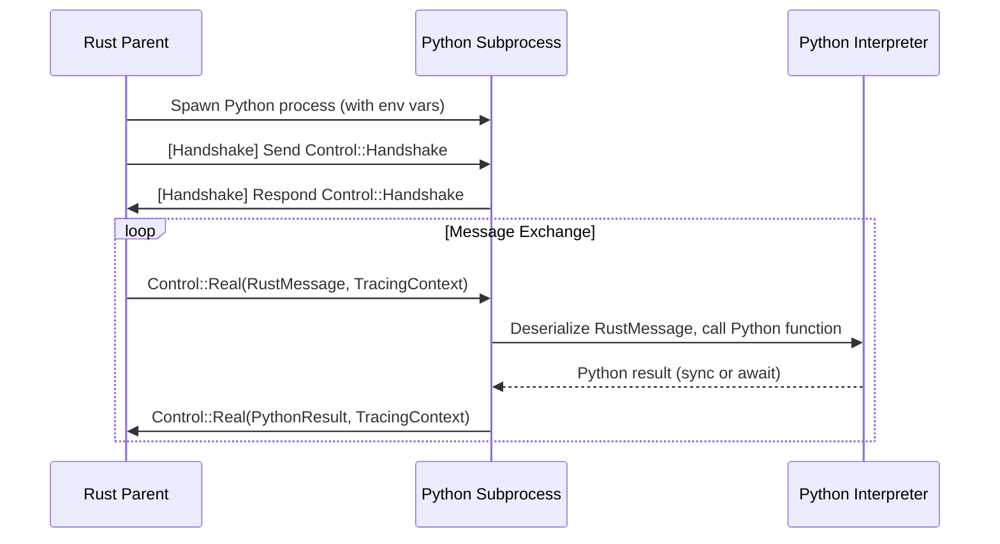
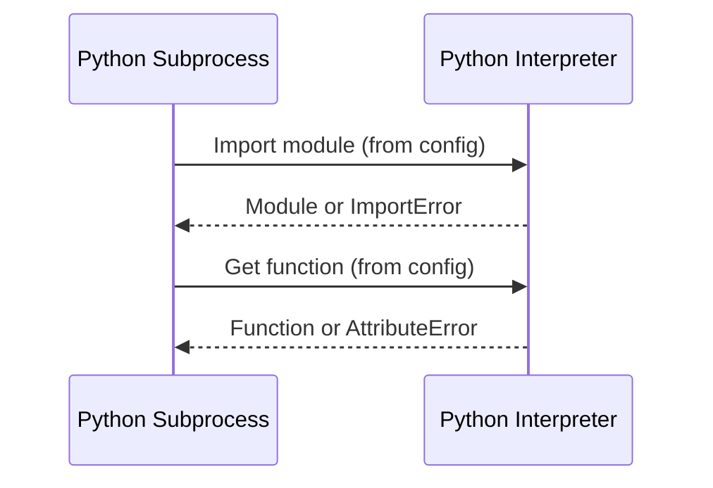
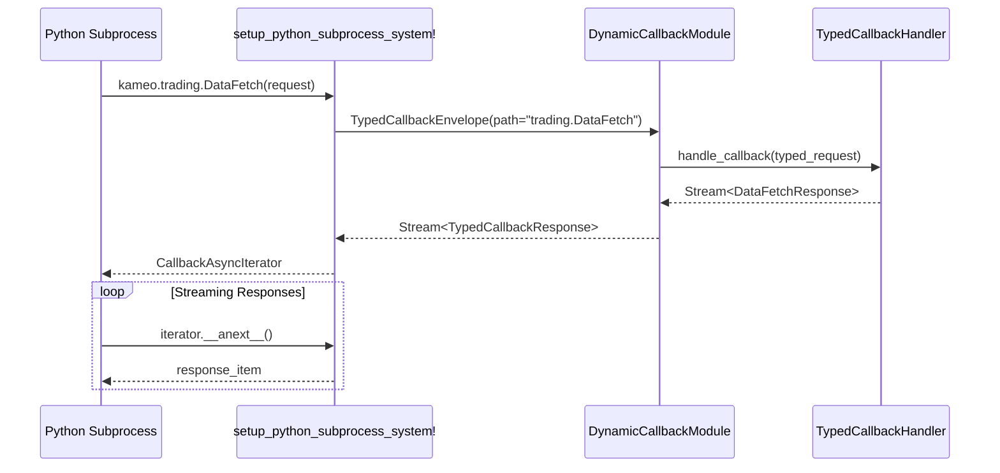

# kameo-snake-handler

A Rust crate for orchestrating async Python subprocesses with strict protocol, deep tracing, and seamless Rust/Python interop.

This crate provides the Python-specific process actor, configuration, error handling, and (de)serialization for the Kameo system. It builds on the generic process/IPC engine in `kameo-child-process`.

---

## Features

- **Dynamic Callback System**: Runtime registration of strongly-typed callback handlers with automatic Python module generation
- **Elegant Python API**: Both legacy (`kameo.callback_handle()`) and modern (`kameo.module.HandlerType()`) callback interfaces
- **Streaming Support**: All callback responses are streams, supporting both single-item and multi-item patterns
- **PythonChildProcessBuilder**: Builder for configuring Python processes with callback handler registration
- **Connection Sharing**: Single Unix socket efficiently handles multiple concurrent callback requests
- **Type Safety**: End-to-end type safety from Python requests to Rust handlers and back
- **PythonConfig**: Comprehensive configuration for Python environment, modules, and execution mode
- **serde_py**: Robust bidirectional serialization between Rust and Python types
- **Error Handling**: Rich, typed error propagation across the Python-Rust boundary
- **Distributed Tracing**: OpenTelemetry integration with span propagation across processes
- **setup_python_subprocess_system! macro**: Zero-boilerplate entry point with dynamic module creation

---

## Additional Documentation

- IPC internals and runtime: `crates/kameo-child-process/README.md`
- Generated Python bindings and usage: `crates/kameo-snake-handler/docs/python-bindings.md`
- Proc-macro IR derivation: add `#[derive(PythonIr)]` to your message/response and callback types and include extra IR via `.with_invocation_type::<T>()` where `T: ProvideIr`.

## The `setup_python_subprocess_system!` Macro

This macro provides a zero-boilerplate entry point for Python subprocesses with dynamic callback systems. It automatically:

- **Sets up Python runtime** with PyO3 and async integration
- **Establishes IPC channels** for both requests and callbacks
- **Creates dynamic Python modules** based on registered callback handlers
- **Injects kameo module** with both legacy and modern callback APIs
- **Handles process lifecycle** including graceful shutdown

**Simple Usage:**

```rust
kameo_snake_handler::setup_python_subprocess_system! {
    actor = (MyMessage),
    child_init = {
        tracing_subscriber::fmt().init();
        kameo_child_process::RuntimeConfig {
            flavor: kameo_child_process::RuntimeFlavor::MultiThread,
            worker_threads: Some(2),
        }
    },
    parent_init = {
        tracing_subscriber::fmt().init();
        tokio::runtime::Builder::new_multi_thread().build()?
            .block_on(async { Ok(()) })?
    }
}
```

### Generated Python API

The macro automatically creates a rich Python API based on your registered callback handlers:

```python
import kameo

# Legacy string-based API (still supported)
response = await kameo.callback_handle('trading.DataFetch', {
    'symbol': 'AAPL', 
    'period': '1d'
})

# Modern module-based API (recommended)
async for item in kameo.trading.DataFetch({
    'symbol': 'AAPL',
    'period': '1d'  
}):
    print(f"Received data: {item}")
```

### Key Features

- **Dynamic Module Creation**: Python modules created automatically from Rust handler registration
- **Type-Safe Routing**: Requests routed to correct handlers based on module.Type path
- **Streaming Responses**: All handlers return async iterators for uniform interface
- **Connection Reuse**: Single Unix socket efficiently handles multiple concurrent callbacks
- **Error Propagation**: Python exceptions and Rust errors properly converted and propagated

---

## Async Python Process Flow



- Parent spawns a Python subprocess, passing config (module, function, env, etc.) via env vars.
- Child loads the Python module/function, sets up the async runtime, and performs handshake.
- Messages are serialized from Rust, deserialized in Python, and vice versa.
- Both sync and async Python functions are supported.

---

## Runtime & Interop Constraints

- **Async runtime**: Uses `tokio` and `pyo3-async-runtimes` for safe, async Python interop.
- **GIL management**: All Python calls are made inside the GIL, with careful handoff between Rust and Python async contexts.
- **Module/function loading**: Python modules and functions are loaded at startup, with errors surfaced as typed Rust errors.
- **Environment**: `PYTHONPATH` and other env vars are set from config; subprocesses inherit only what is needed.
- **Error propagation**:  Python exceptions are mapped to Rust error types, preserving context and traceability.

---

## Module & Function Loading



- On startup, the child imports the specified Python module and function.
- Errors (missing module/function, import errors, etc.) are mapped to `PythonExecutionError` variants.

---

## Dynamic Callback System

The dynamic callback system allows Python subprocesses to invoke strongly-typed Rust handlers with automatic routing and streaming responses.



### Rust: Defining Callback Handlers

```rust
use kameo_snake_handler::{PythonChildProcessBuilder, PythonConfig};
use kameo_child_process::callback::TypedCallbackHandler;
use serde::{Serialize, Deserialize};

// Define your callback request/response types
#[derive(Serialize, Deserialize, Debug)]
pub struct DataFetchRequest {
    pub symbol: String,
    pub period: String,
}

#[derive(Serialize, Deserialize, Debug)]
pub struct DataFetchResponse {
    pub timestamp: String,
    pub price: f64,
    pub volume: u64,
}

// Implement the handler
pub struct DataFetchHandler;

#[async_trait::async_trait]
impl TypedCallbackHandler<DataFetchRequest> for DataFetchHandler {
    type Response = DataFetchResponse;
    
    async fn handle_callback(
        &self, 
        request: DataFetchRequest
    ) -> Result<Pin<Box<dyn Stream<Item = Result<Self::Response, PythonExecutionError>> + Send>>, PythonExecutionError> {
        // Simulate fetching historical data (streaming response)
        let responses = (0..10).map(move |i| {
            Ok(DataFetchResponse {
                timestamp: format!("2024-01-{:02}T10:{:02}:00Z", i + 1, i * 5),
                price: 150.0 + (i as f64 * 2.5),
                volume: 1000000 + (i * 50000),
            })
        });
        
        Ok(Box::pin(futures::stream::iter(responses)))
    }
    
    fn type_name(&self) -> &'static str {
        "DataFetch"
    }
}

// Register handlers and spawn subprocess
let config = PythonConfig {
    python_path: vec!["python3".to_string()],
    module_name: "my_trading_module".to_string(),
    function_name: "handle_message".to_string(),
    env_vars: vec![],
    is_async: true,
    enable_otel_propagation: false,
};

let pool = PythonChildProcessBuilder::<MyMessage>::new(config)
    .with_callback_handler("trading", DataFetchHandler)
    .with_callback_handler("trading", OrderHandler) 
    .with_callback_handler("weather", WeatherHandler)
    .spawn_pool(2, None)
    .await?;
```

### Python: Using the Dynamic Callback API

```python
# my_trading_module.py
import kameo

async def handle_message(message):
    # Modern module-based API (recommended)
    print("Fetching market data...")
    async for data_point in kameo.trading.DataFetch({
        'symbol': 'AAPL',
        'period': '1d'
    }):
        print(f"Price: ${data_point['price']}, Volume: {data_point['volume']}")
    
    # Multiple callback types in same module
    order_result = kameo.trading.OrderHandler({
        'action': 'buy',
        'symbol': 'AAPL', 
        'quantity': 100
    })
    async for result in order_result:
        print(f"Order status: {result}")
    
    # Different modules
    weather_data = kameo.weather.CurrentConditions({'location': 'NYC'})
    async for conditions in weather_data:
        print(f"Weather: {conditions}")
    
    # Legacy API still works
    legacy_response = await kameo.callback_handle('trading.DataFetch', {
        'symbol': 'GOOGL',
        'period': '1h'
    })
    async for item in legacy_response:
        print(f"Legacy response: {item}")
    
    return {"status": "completed"}
```

### Callback System Features

- **Type Safety**: Full end-to-end type safety from Python → Rust → Python
- **Dynamic Routing**: Automatic routing based on module.TypeName paths
- **Streaming Responses**: All callbacks return async iterators for uniform interface
- **Multiple Modules**: Organize handlers into logical modules (trading, weather, etc.)
- **Concurrent Callbacks**: Multiple callbacks can run concurrently using the same connection
- **Backwards Compatibility**: Legacy `callback_handle()` API still supported

---

## Error Handling

- All errors are strongly typed (`PythonExecutionError`) and instrumented with tracing.
- Protocol errors, handshake failures, Python exceptions, and (de)serialization issues are all surfaced as distinct error types.
- Errors are propagated across the IPC boundary and can be handled or logged in the parent.

---

## Complete Example: Trading System with Dynamic Callbacks

### Rust Parent Process

```rust
use kameo_snake_handler::{PythonChildProcessBuilder, PythonConfig};
use kameo_child_process::callback::TypedCallbackHandler;
use serde::{Serialize, Deserialize};

// Define message types for main communication
#[derive(Serialize, Deserialize, Debug, Clone)]
pub struct TradeOrder {
    pub symbol: String,
    pub quantity: u32,
    pub order_type: String,
}

impl kameo_child_process::KameoChildProcessMessage for TradeOrder {
    type Ok = TradeResult;
}

#[derive(Serialize, Deserialize, Debug, Clone)]
pub struct TradeResult {
    pub order_id: String,
    pub status: String,
    pub executed_price: f64,
}

// Define callback types for data requests
#[derive(Serialize, Deserialize, Debug)]
pub struct MarketDataRequest {
    pub symbol: String,
    pub timeframe: String,
}

#[derive(Serialize, Deserialize, Debug)]
pub struct PriceData {
    pub timestamp: String,
    pub price: f64,
    pub volume: u64,
}

// Implement callback handler
pub struct MarketDataHandler;

#[async_trait::async_trait]
impl TypedCallbackHandler<MarketDataRequest> for MarketDataHandler {
    type Response = PriceData;
    
    async fn handle_callback(&self, request: MarketDataRequest) -> Result<Pin<Box<dyn Stream<Item = Result<Self::Response, kameo_child_process::error::PythonExecutionError>> + Send>>, kameo_child_process::error::PythonExecutionError> {
        // Simulate real-time market data stream
        let symbol = request.symbol.clone();
        let data_stream = futures::stream::iter((0..100).map(move |i| {
            Ok(PriceData {
                timestamp: format!("2024-01-01T10:{:02}:00Z", i),
                price: 150.0 + (i as f64 * 0.1),
                volume: 1000 + (i * 10),
            })
        }));
        Ok(Box::pin(data_stream))
    }
    
    fn type_name(&self) -> &'static str {
        "MarketData"
    }
}

#[tokio::main]
async fn main() -> Result<(), Box<dyn std::error::Error>> {
    // Configure Python subprocess
    let config = PythonConfig {
        python_path: vec!["python3".to_string()],
        module_name: "trading_strategy".to_string(),
        function_name: "execute_trade".to_string(),
        env_vars: vec![],
        is_async: true,
        enable_otel_propagation: false,
    };

    // Spawn subprocess with callback handlers
    let pool = PythonChildProcessBuilder::<TradeOrder>::new(config)
        .with_callback_handler("market", MarketDataHandler)
        .spawn_pool(2, None)
        .await?;

    // Send trade order to Python
    let actor = pool.get_actor();
    let trade_result = actor.ask(TradeOrder {
        symbol: "AAPL".to_string(),
        quantity: 100,
        order_type: "market".to_string(),
    }).await?;

    println!("Trade executed: {:?}", trade_result);
    Ok(())
}
```

### Python Strategy Implementation

```python
# trading_strategy.py
import kameo
import asyncio

async def execute_trade(order):
    """
    Main trading function that uses callbacks to get market data
    """
    symbol = order['symbol']
    quantity = order['quantity']
    
    print(f"Executing trade for {quantity} shares of {symbol}")
    
    # Get real-time market data using the elegant callback API
    print("Fetching market data...")
    prices = []
    async for price_data in kameo.market.MarketData({
        'symbol': symbol,
        'timeframe': '1m'
    }):
        prices.append(price_data['price'])
        print(f"Current price: ${price_data['price']}")
        
        # Simple strategy: buy when we have enough data
        if len(prices) >= 5:
            avg_price = sum(prices[-5:]) / 5
            current_price = price_data['price']
            
            if current_price < avg_price * 0.99:  # 1% below average
                print(f"Good buy signal! Executing at ${current_price}")
                break
    
    # Return trade result
    return {
        'order_id': f"ORD-{symbol}-{quantity}",
        'status': 'executed',
        'executed_price': current_price
    }
```

This example demonstrates:

- **Type-safe communication** between Rust and Python
- **Dynamic callback registration** with the `market` module
- **Streaming responses** from callback handlers
- **Elegant Python API** using `kameo.market.MarketData()`
- **Real-world use case** of a trading system with market data callbacks

---

## serde_py: Rust/Python (De)Serialization

- Uses custom (de)serializer to convert between Rust types and Python objects.
- Supports all primitives, collections, enums, and deeply nested structures.
- Property-based tests ensure roundtrip correctness and edge case coverage.

---

## Tracing & Telemetry

- All message flows, handshakes, Python calls, and errors are traced with `tracing` and OpenTelemetry.
- Spans are propagated across process boundaries for full distributed traceability.

---

## Integration with kameo-child-process

- Builds on the generic process/IPC/actor/callback engine in `kameo-child-process`.
- Only Python-specific logic (config, actor, error, serde) lives here; all process/IPC logic is in the process crate.

---

## See Also

- For generic process management, see `kameo-child-process`.
- For integration tests and examples, see `kameo-snake-testing`.