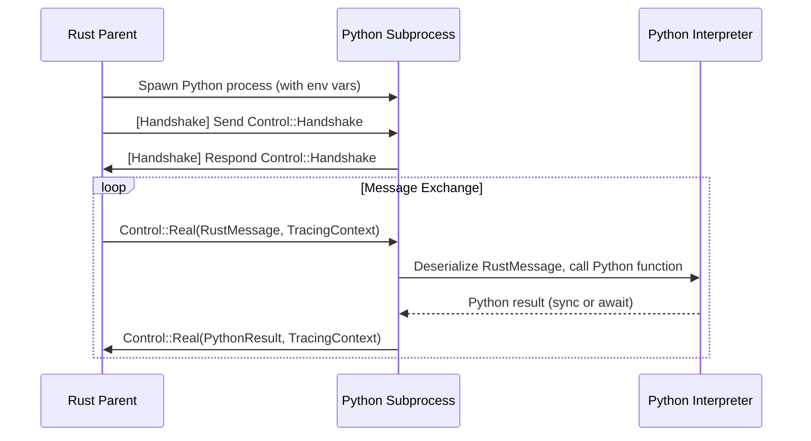
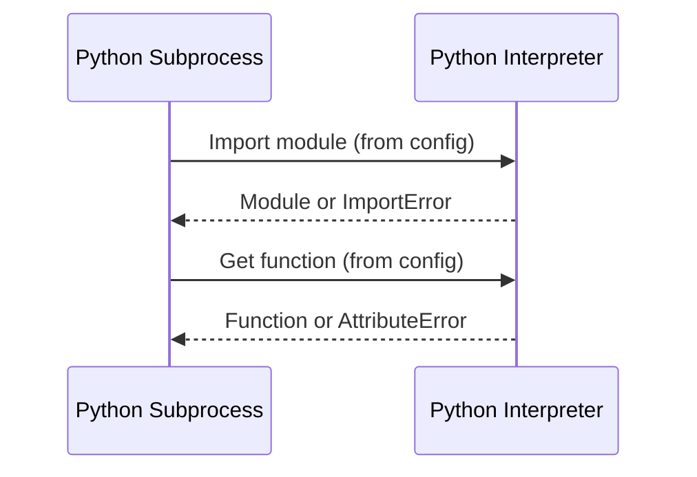
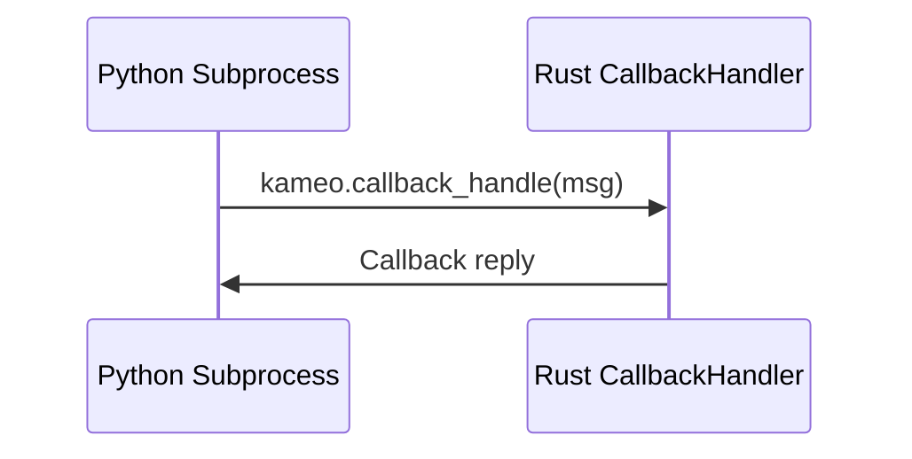

# kameo-snake-handler

A Rust crate for orchestrating async Python subprocesses with strict protocol, deep tracing, and seamless Rust/Python interop.

This crate provides the Python-specific process actor, configuration, error handling, and (de)serialization for the Kameo system. It builds on the generic process/IPC engine in `kameo-child-process`.

---

## Features

- **PythonActor**: Actor for running Python modules/functions as async subprocesses.
- **PythonChildProcessBuilder**: Builder for configuring and spawning Python child processes.
- **PythonConfig**: Typed config for Python environment, module, function, and async/sync mode.
- **serde_py**: Robust (de)serialization between Rust and Python types.
- **Error handling**: Rich, typed error types for all Python execution and protocol failures.
- **Tracing**: Deep, async-aware tracing for all message flows, errors, and Python calls.
- **setup_python_subprocess_system! macro**: Boilerplate-free entrypoint for Python subprocesses.

---

## The `setup_python_subprocess_system!` Macro

This macro provides a boilerplate-free entrypoint for Python subprocesses. It sets up the async runtime, loads the Python config, and runs the actor loop. **You must use this macro in your `main.rs` for any Python subprocess binary.**

### Advanced Usage: Multiple Actors and Custom Initialization

You can use the macro in an advanced form to:

- Register multiple actors (with different message/callback types)
- Provide custom initialization logic for the child and parent (e.g., tracing, runtime config, etc.)

**Example:**

```rust
kameo_snake_handler::setup_python_subprocess_system! {
    actors = {
        (PythonActor<TestMessage, TestCallbackMessage>, TestMessage, TestCallbackMessage),
        // You can add more actor/message/callback tuples here
    },
    child_init = {{
        // This block runs in the child process before the actor loop starts
        tracing_subscriber::fmt()
            .with_env_filter("debug")
            .with_file(true)
            .with_line_number(true)
            .with_thread_ids(true)
            .with_thread_names(true)
            .init();
        kameo_child_process::RuntimeConfig {
            flavor: kameo_child_process::RuntimeFlavor::MultiThread,
            worker_threads: Some(2),
        }
    }},
    parent_init = {
        // This block runs in the parent process before any actors are spawned
        tracing_subscriber::fmt()
            .with_env_filter("info")
            .with_file(true)
            .with_line_number(true)
            .with_thread_ids(true)
            .with_thread_names(true)
            .init();

        let runtime = tokio::runtime::Builder::new_multi_thread()
            .worker_threads(2)
            .thread_name("parent-thread")
            .enable_all()
            .build()?;

        runtime.block_on(async {
            // Custom parent logic, e.g. running test suites
            Ok::<(), Box<dyn std::error::Error>>(())
        })?
    }
}
```

#### Key Points

- **actors**: Register one or more actor/message/callback type tuples. Each tuple is `(ActorType, MessageType, CallbackType)`.
- **child_init**: A block of code run in the child process before the actor loop. Use this to set up tracing, runtime config, etc, it is deliberately limited and only returns a runtime config.
- **parent_init**: A block of code run in the parent process before any actors are spawned. Use this to set up tracing, the tokio runtime, etc.

#### Requirements

- All types must implement the required traits.
- The macro must be used at the root of your binary crate (not inside a function).
- The macro handles all the tricky details of runtime, GIL, and protocol setup for you.

**If you forget to use this macro, or use the wrong types, your Python subprocess will not work!**

---

## Async Python Process Flow



- Parent spawns a Python subprocess, passing config (module, function, env, etc.) via env vars.
- Child loads the Python module/function, sets up the async runtime, and performs handshake.
- Messages are serialized from Rust, deserialized in Python, and vice versa.
- Both sync and async Python functions are supported.

---

## Runtime & Interop Constraints

- **Async runtime**: Uses `tokio` and `pyo3-async-runtimes` for safe, async Python interop.
- **GIL management**: All Python calls are made inside the GIL, with careful handoff between Rust and Python async contexts.
- **Module/function loading**: Python modules and functions are loaded at startup, with errors surfaced as typed Rust errors.
- **Environment**: `PYTHONPATH` and other env vars are set from config; subprocesses inherit only what is needed.
- **Error propagation**: All Python exceptions are mapped to rich Rust error types, preserving context and traceability.

---

## Module & Function Loading



- On startup, the child imports the specified Python module and function.
- Errors (missing module/function, import errors, etc.) are mapped to `PythonExecutionError` variants.

---

## Callback Usage

Callbacks allow the Python subprocess to request information or actions from the Rust parent asynchronously. The callback is injected as `kameo.callback_handle` in the Python environment.



### Rust: Defining and Using a CallbackHandler

```rust
use kameo_snake_handler::{PythonChildProcessBuilder, PythonConfig, PythonExecutionError};
use kameo_child_process::{CallbackHandler, ChildCallbackMessage};

#[derive(serde::Serialize, serde::Deserialize, Debug)]
pub struct MyCallbackMessage {
    pub question: String,
}

impl ChildCallbackMessage for MyCallbackMessage {
    type Reply = String;
}

pub struct MyCallbackHandler;

#[async_trait::async_trait]
impl CallbackHandler<MyCallbackMessage> for MyCallbackHandler {
    async fn handle(&mut self, callback: MyCallbackMessage) -> String {
        println!("Received callback from Python: {}", callback.question);
        "This is the Rust callback reply!".to_string()
    }
}

// Spawning the Python child with a callback handler
let config = PythonConfig {
    python_path: vec!["/path/to/site-packages".to_string()],
    module_name: "my_module".to_string(),
    function_name: "my_func".to_string(),
    env_vars: vec![],
    is_async: true,
    module_path: ".".to_string(),
};

let builder = PythonChildProcessBuilder::new(config)
    .log_level(tracing::Level::INFO)
    .with_callback_handler(MyCallbackHandler);

let actor_ref = builder.spawn::<MyMessage>().await?;
```

### Python: Using the Injected Callback

```python
# my_module.py
import kameo

def handle_message(message):
    # Synchronous callback example
    reply = kameo.callback_handle({"question": "What is your name, Rust?"})
    print(f"Rust replied: {reply}")
    return {"status": "ok", "reply": reply}

async def handle_message_async(message):
    # Asynchronous callback example
    reply = await kameo.callback_handle({"question": "What is your async name, Rust?"})
    print(f"Rust replied (async): {reply}")
    return {"status": "ok", "reply": reply}
```

- The `kameo.callback_handle` function is injected into the Python environment.
- Use it directly for sync or async callbacks.
- The Rust `CallbackHandler` receives the message and returns a reply.

---

## Error Handling

- All errors are strongly typed (`PythonExecutionError`) and instrumented with tracing.
- Protocol errors, handshake failures, Python exceptions, and (de)serialization issues are all surfaced as distinct error types.
- Errors are propagated across the IPC boundary and can be handled or logged in the parent.

---

## Example: Spawning a Python Child Process (No Callback)

```rust
use kameo_snake_handler::{PythonChildProcessBuilder, PythonConfig, PythonExecutionError};

let config = PythonConfig {
    python_path: vec!["/path/to/site-packages".to_string()],
    module_name: "my_module".to_string(),
    function_name: "my_func".to_string(),
    env_vars: vec![],
    is_async: true,
    module_path: ".".to_string(),
};

let builder = PythonChildProcessBuilder::new(config)
    .log_level(tracing::Level::INFO);

let actor_ref = builder.spawn::<MyMessage>().await?;
```

---

## serde_py: Rust/Python (De)Serialization

- Uses custom (de)serializer to convert between Rust types and Python objects.
- Supports all primitives, collections, enums, and deeply nested structures.
- Property-based tests ensure roundtrip correctness and edge case coverage.

---

## Tracing & Telemetry

- All message flows, handshakes, Python calls, and errors are traced with `tracing` and OpenTelemetry.
- Spans are propagated across process boundaries for full distributed traceability.

---

## Integration with kameo-child-process

- Builds on the generic process/IPC/actor/callback engine in `kameo-child-process`.
- Only Python-specific logic (config, actor, error, serde) lives here; all process/IPC logic is in the process crate.

---

## See Also

- For generic process management, see `kameo-child-process`.
- For integration tests and examples, see `kameo-snake-testing`. 